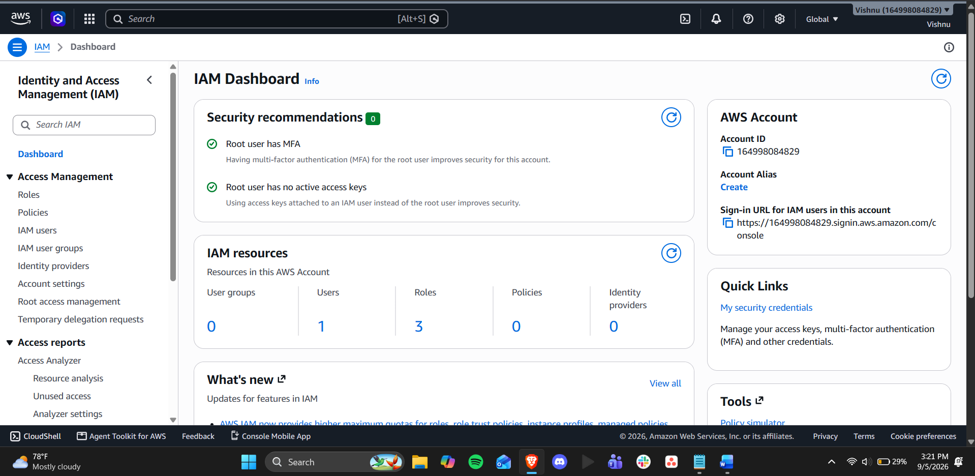
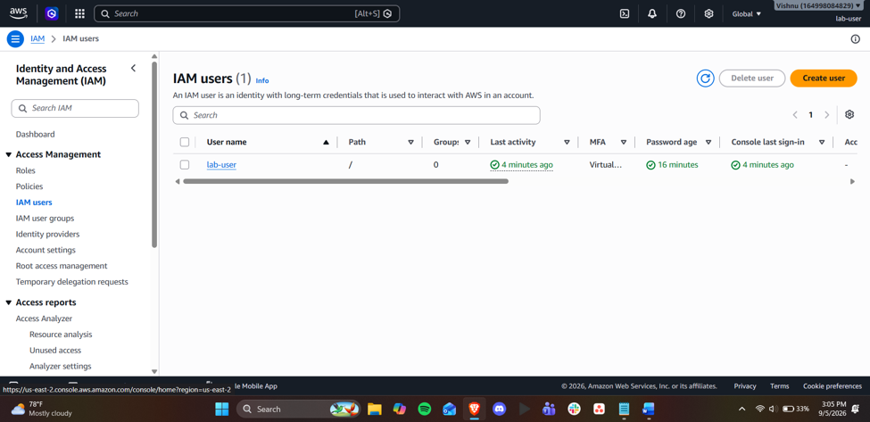
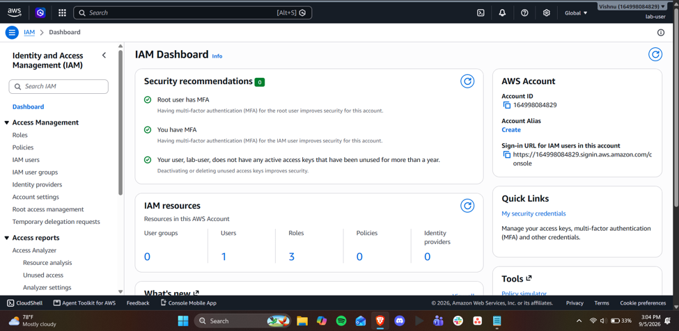
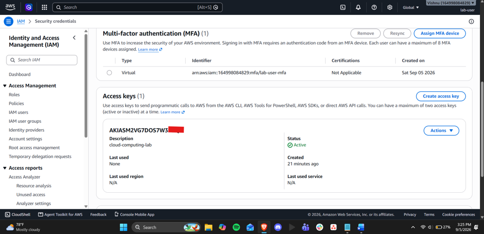

Lab 01: Configuring AWS CLI and GitHub Inside Your Docker Container
Name: Vishnu Upadhya

---
1. Screenshot of your IAM dashboard showing “MFA on root user: Enabled”:
Screenshot of `aws --version` output:

---
2. Screenshot of IAM Users list showing lab user:
Screenshot of `aws sts get-caller-identity` showing your IAM username in the ARN (not root):

---
3. Screenshot showing MFA enabled on the IAM user:
Screenshot of `git config --global --list` showing your name and college email:

---
4. Confirmation that you successfully generated an access key:
Screenshot of your GitHub repository showing `list_buckets.sh` successfully pushed:

---
5. One paragraph reflecting on why root user MFA and least-privilege IAM users matter for cloud security:
Even in a private repository, you should never commit AWS credentials or a GitHub Personal Access Token because Git tracks every change permanently—once a secret is committed, it remains recoverable in the repository's history even if you delete it in a later commit. The lab specifically has you configure the AWS CLI using your IAM lab user's Access Key ID and Secret Access Key (never the root user's credentials), and if these were committed to a repo, anyone with access—now or in the future, if the repo's visibility ever changes or gets forked—could use them to authenticate as your IAM user and access or modify your AWS account. The same applies to your GitHub PAT: since it's a revocable, scoped credential that grants push/pull access to your repositories, exposing it in a commit would let someone else authenticate as you on GitHub. This is exactly why the lab has you rely on a credential helper to cache the PAT temporarily in memory instead of storing it in a plain text file, and why the instructor's note reminds students to revoke and regenerate tokens at the end of the semester—treating these secrets like passwords means keeping them out of version control entirely, so a mistake in repo visibility or a stale token never turns into unauthorized access to your account.