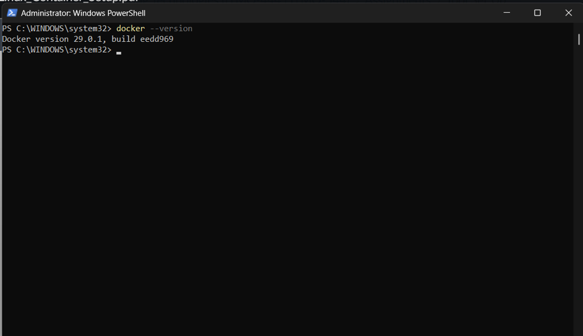
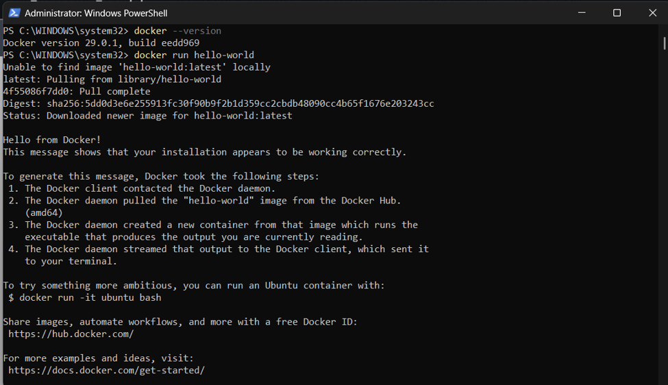
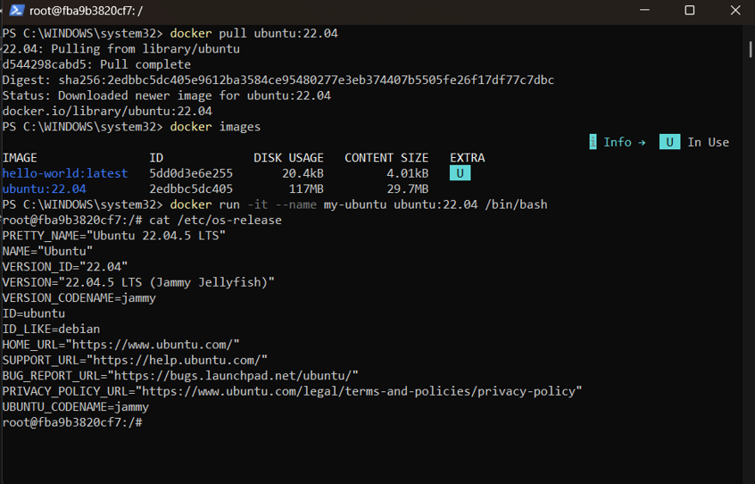
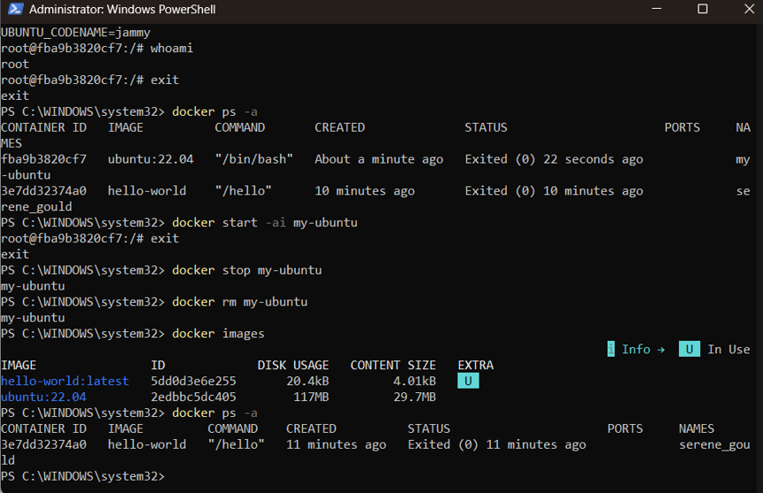

Lab 01: Configuring AWS CLI and GitHub Inside Your Docker Container
Name: Vishnu Upadhya

---
1. Screenshot of docker --version output:
Screenshot of `aws --version` output:

---
2. Screenshot of the hello-world container output:
Screenshot of `aws sts get-caller-identity` showing your IAM username in the ARN (not root):

---
3. Screenshot of cat /etc/os-release run inside the Ubuntu container:
Screenshot of `git config --global --list` showing your name and college email:  

---
4. Screenshot of docker ps -a before and after removing my-ubuntu:
Screenshot of your GitHub repository showing `list_buckets.sh` successfully pushed:

---
5. One paragraph explaining, in your own words, the difference between a Docker image and a Docker container:  
A Docker image is a static blueprint, like a class definition that is not tied to any running application or process, but it does contain an application's code, dependencies, libraries, and configuration required to run it. A container, on the other hand, is a running instance of the image: A container is a running image with a writable layer on top of it, a separate file system, network interface, and resource allocation. This translates into the ability to create several containers from one image at once, each with its own state, independent of the other containers and without affecting the underlying image. Simply put, the image is the fixed template that is stored in disk, and the container is the running, executable environment that is built from that template; the gap between a plan and its execution.