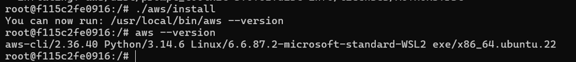
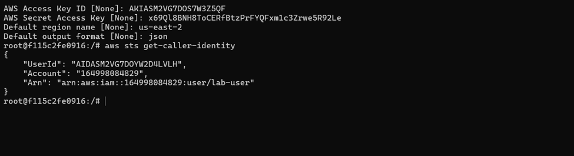
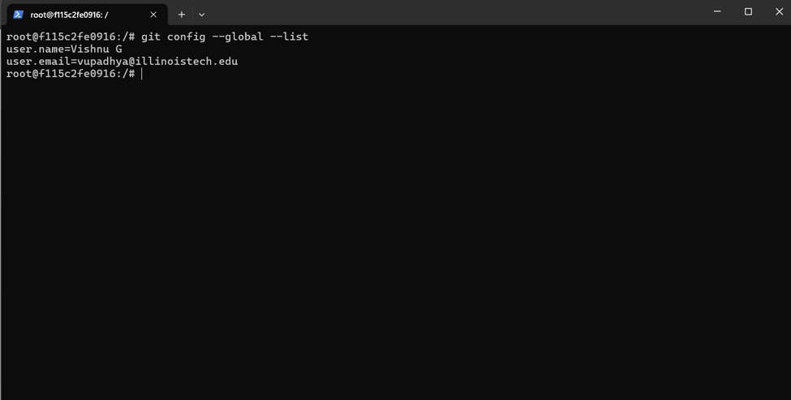
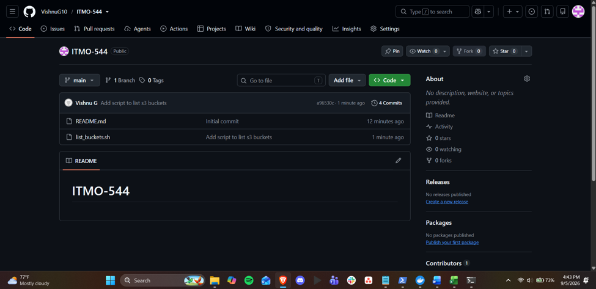

Lab 01: Configuring AWS CLI and GitHub Inside Your Docker Container
Name: Vishnu Upadhya

---
1. Screenshot of aws --version output:
Screenshot of `aws --version` output:

---
2. Screenshot of aws sts get-caller-identity:
Screenshot of `aws sts get-caller-identity` showing your IAM username in the ARN (not root):

---
3. Screenshot of git config --global –list:
Screenshot of `git config --global --list` showing your name and college email:

---
4. Screenshot of GitHub repository showing list_buckets.sh successfully pushed:
Screenshot of your GitHub repository showing `list_buckets.sh` successfully pushed:

---
5. One paragraph explaining why you should never commit AWS credentials or GitHub tokens to a repository, even a private one:
Even in a private repository, there is a risk that is out of proportion to the convenience of committing AWS credentials or GitHub tokens. By design, Git history is permanent: If a secret is committed, it is not deleted in a later commit, as anyone with access to the repo can still go through the history and find it. Private repositories can also go public if they are misconfigured, if their permissions are accidentally changed, if they are forked, or if they are cloned by a collaborator who then mishandles it, at which point the exposed credentials are visible to anyone. A single accidentally pushed key or token to a public fork or a poorly set-up repo can be found and used in minutes as automated tools and bots scan public GitHub for exposed keys and tokens. A leaked AWS key can be used to spin up resources, access data, or rack up charges under your account, and a leaked GitHub token can give write access to your repositories, so the only safe way to do it is to not put secrets in version control at all, using environment variables, credential caches, or secret managers, so that even if you make a mistake in your repo visibility, it will not lead to a security breach.