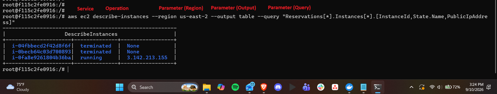
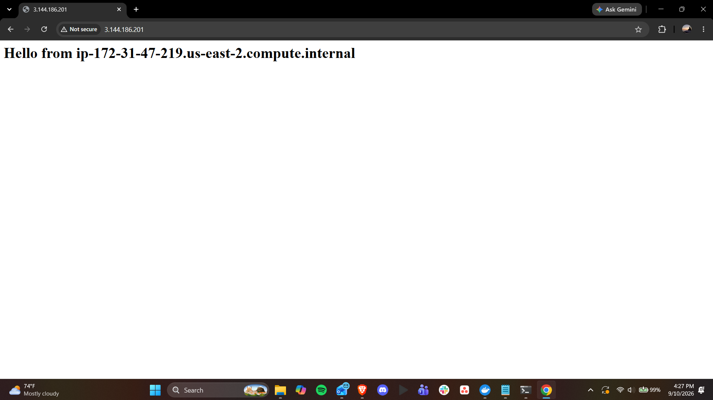
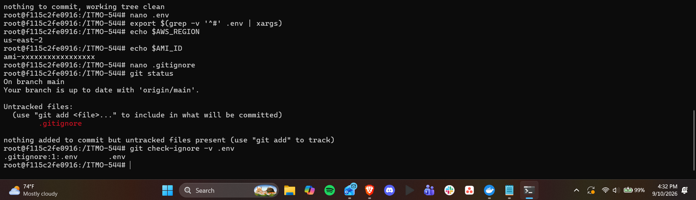
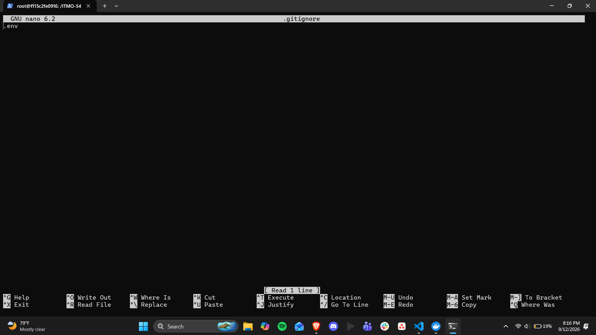
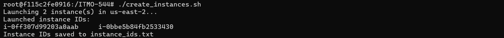
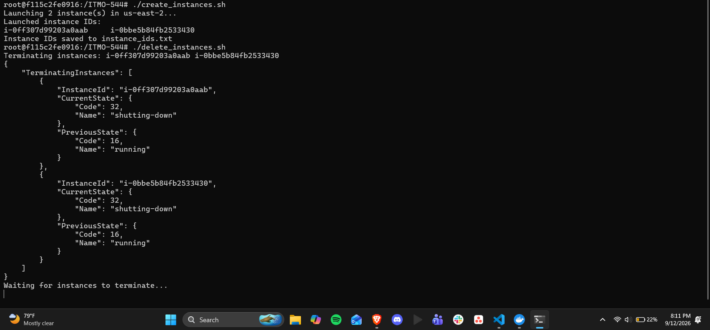

# Lab 02: AWS CLI Syntax, Launching EC2 Instances, and Environment-Based Scripting  
# Name: Vishnu Upadhya

---
1. Screenshot of a decomposed aws ec2 describe-instances command with each part labeled (service/operation/parameters):

---
2. Screenshot of the “Hello from…” web page from Example 2 (Part C5):

---
3. Screenshot of git status showing .env is not tracked, alongside your .gitignore file contents:
  

  
---
4. Screenshot of create_instances.sh output showing 2 instance IDs:
  
---
5. Screenshot of delete_instances.sh output confirming termination:

---
7. Link to your GitHub repo showing create_instances.sh , delete_instances.sh , .env. xample , and .gitignore (but not .env ):   
[Github repo](https://github.com/VishnuG10/ITMO-544)
---
8. One paragraph explaining why environment files are excluded from Git, even in a “private” repository:  
The environment files may contain security group Ids or Ami Id or even actual secrets. And storing the .env file in github is a bad practice as the repository visibility can be accidentaly changed. This could lead to credentials being exposed to the person viewing the repo, including automated bots. If the Ami Id and tokens are exposed, the aws account will be at risk and it may cause unauthorized resource access and the account owner will have to bear the cost.