# Lab 03: Two-Tier File Upload & Display with EC2, S3, and IAM Roles  
# Name: Vishnu Upadhya  

---
1.  Screenshot of your local lab03/uploader-app/ and lab03/viewer-app/ folders showing app.js and package.json in each.

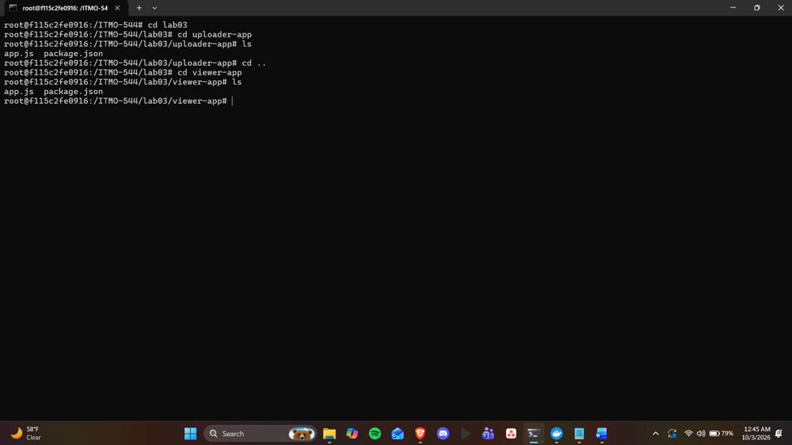

2.  Screenshot of the Uploader page and a successful upload confirmation.

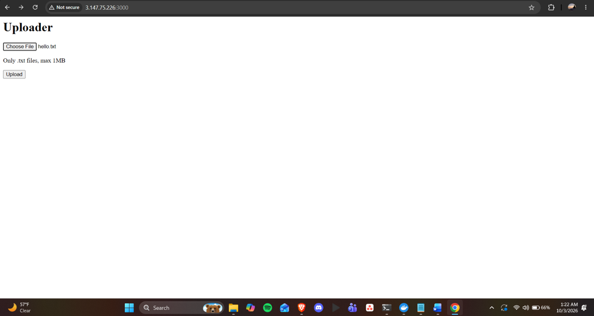

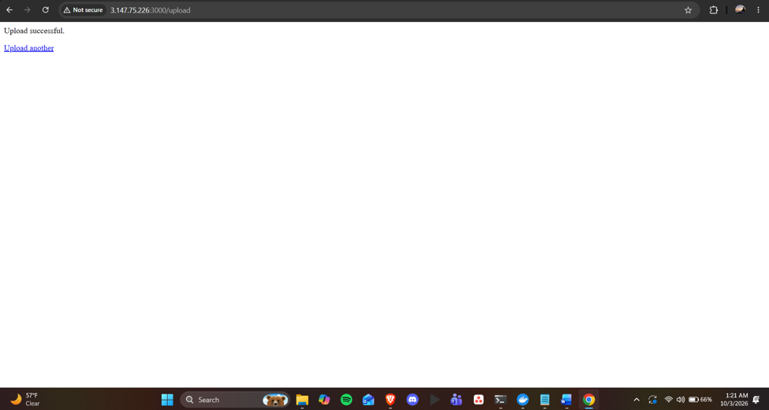

3.  Screenshot of attempting to upload a .txt file larger than 1MB, showing the “file exceeds the 1MB limit” error.

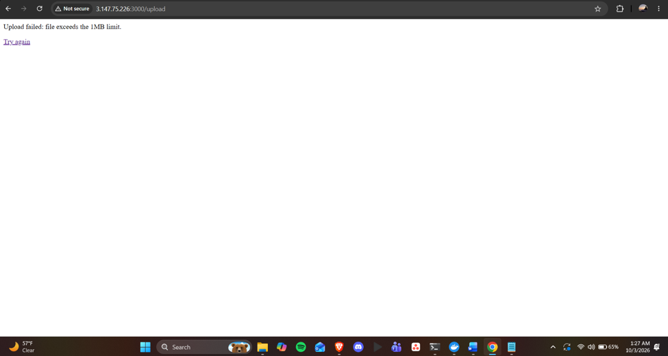

4.  Screenshot of attempting to upload a non- .txt file (e.g., a .jpg or .pdf ), showing the “only .txt files are allowed” error.

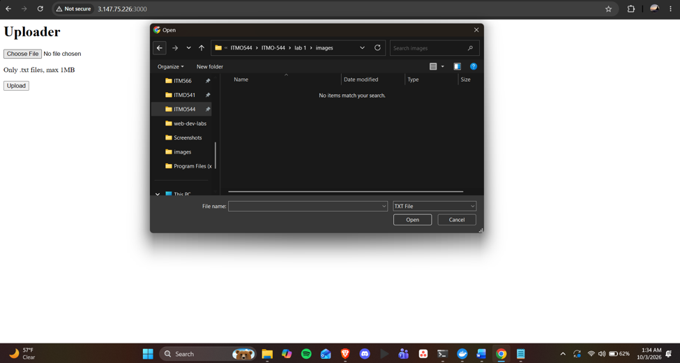  
**Doesn’t allow upload of any other format. So I couldn’t upload any other file.**

5.  Screenshot of the Viewer page displaying the uploaded file’s content.

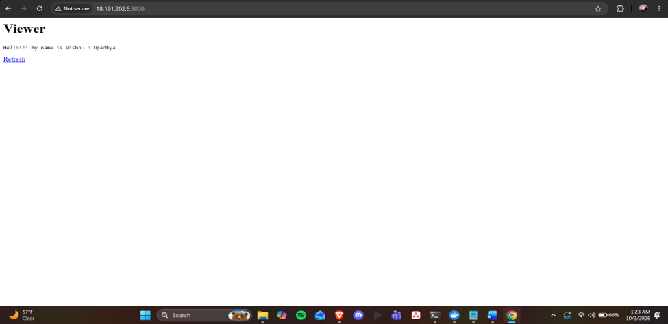

6.  Screenshot of the Viewer page after uploading a second, different file and clicking Refresh, showing the updated content.

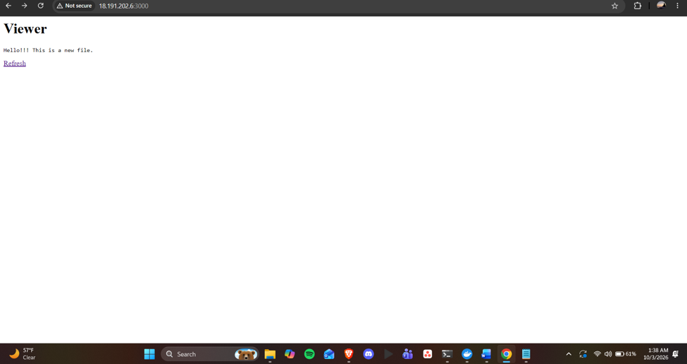

7.  Screenshot of aws ec2 describe-launch-templates showing both templates.

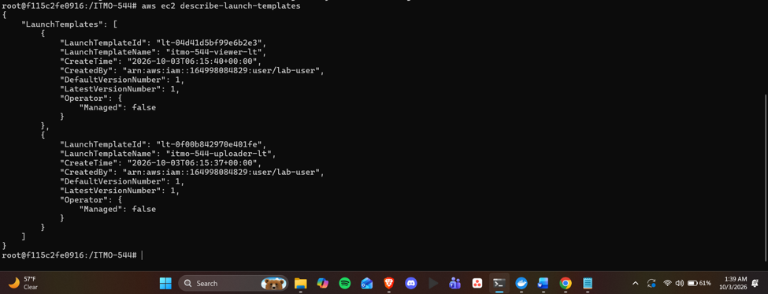

8.  Screenshot of aws ec2 describe-launch-template-versions --launch-template-name \<uploader-lt-name\> after re-running the create script twice, showing more than one version.

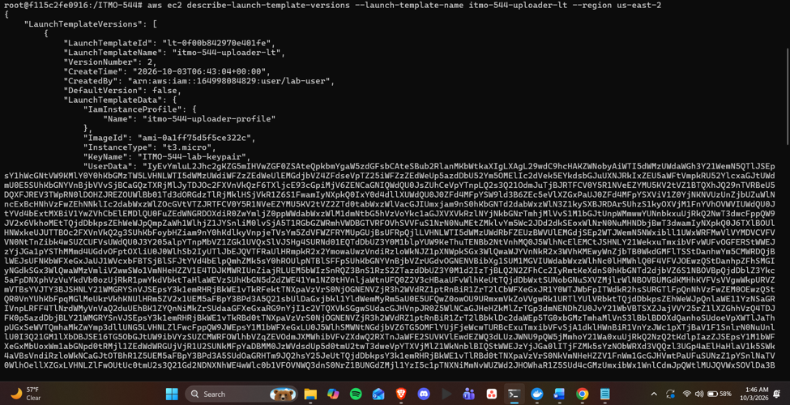

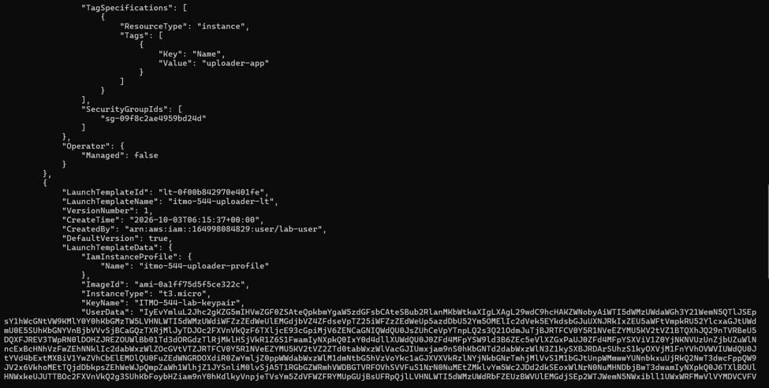

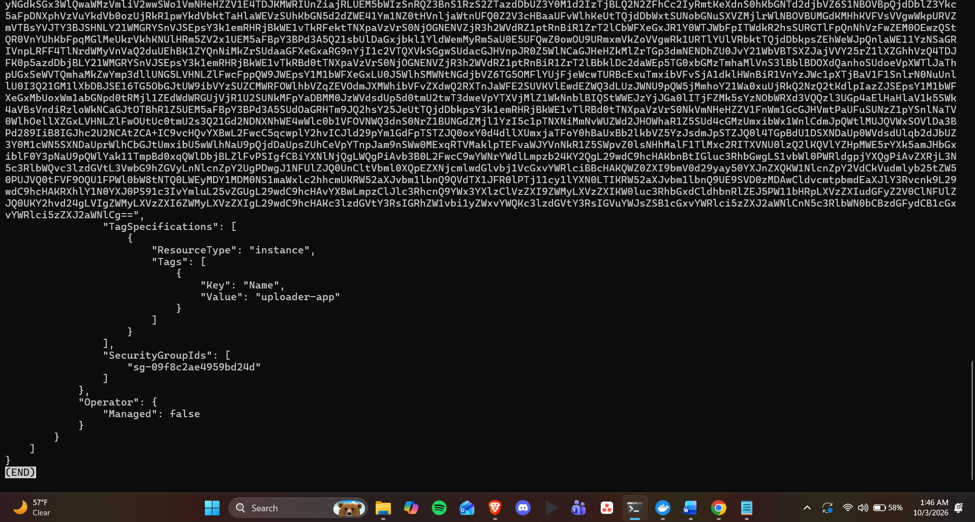

9.  aws iam get-role-policy output (or screenshot) for both roles, showing each has only its one intended action on the exact shared.txt key.

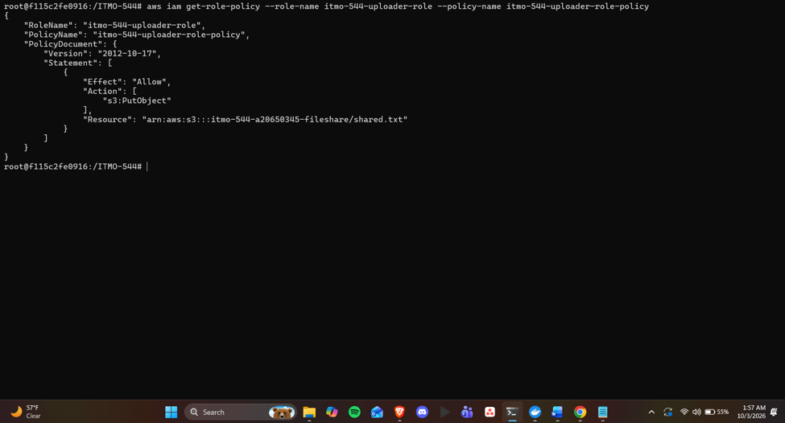

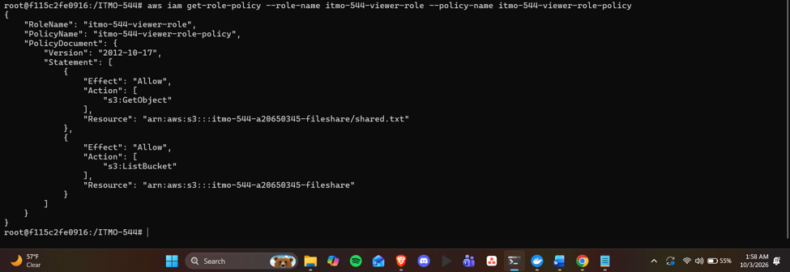

10. Screenshot of create_app_stack.sh output showing both instances running with public IPs.

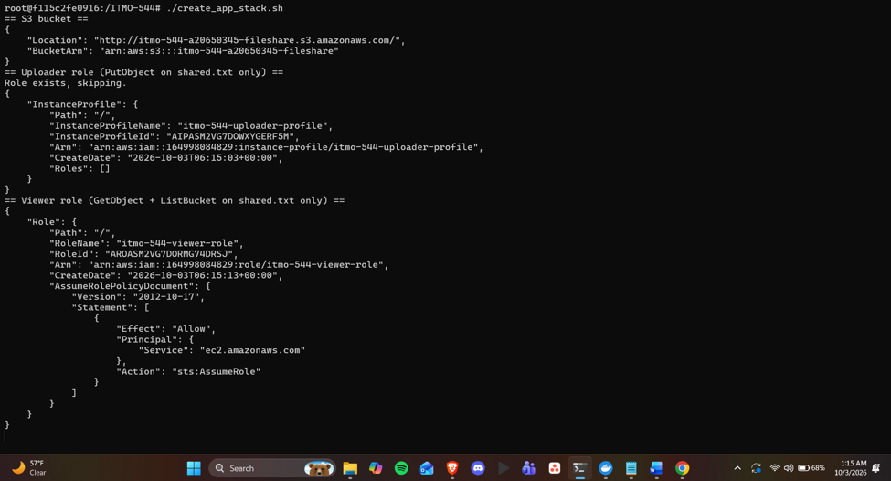

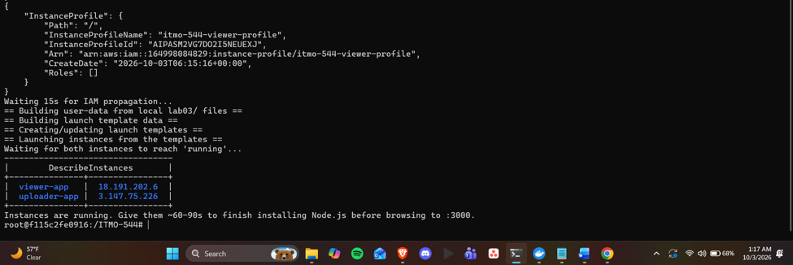

11. Screenshot of delete_app_stack.sh completing with no errors.

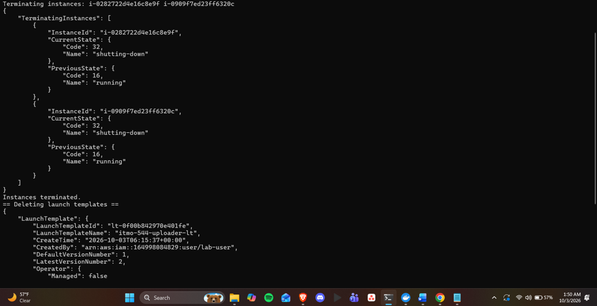

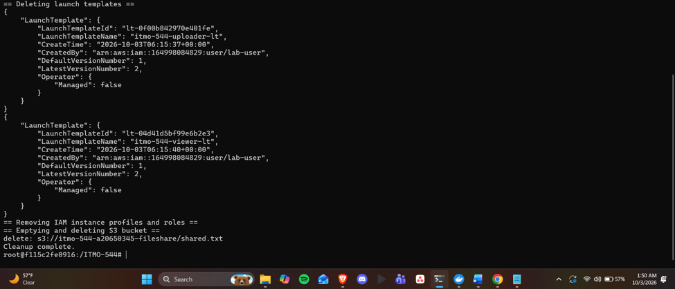

12. One paragraph explaining why the uploader and viewer use separate IAM roles instead of one shared role with both permissions.
The uploader and viewer have separate IAM roles, ensuring that each instance has only the necessary permissions. The uploader is only supposed to write one object, which is why it has only the s3:PutObject permission on shared.txt. The viewer only has to read, so only s3:GetObject for shared.txt and for the bucket, s3:ListBucket are allowed. If the uploader had been compromised, an attacker would be able to modify shared.txt without being able to read any data. If the viewer is compromised, an attacker will be able to read the file, but not modify or replace it. If you only had one role, both instances would have all of the permissions. So, if any one instance were breached, more than what that instance would need would be exposed. Separate roles also allow for simpler permission auditing and updating as changes to one service will never impact on the other service.  

13. One or two sentences explaining why embedding code directly into user-data means the instance never needs a Git or S3 credential just to fetch its own code.    
The app code is embedded in the user-data script, which is delivered when an instance is launched, and is simply extracted into files upon instance startup. No token, key or IAM permission is required to get the code to the machine, nothing has to be downloaded from any Git repository or S3 bucket.
